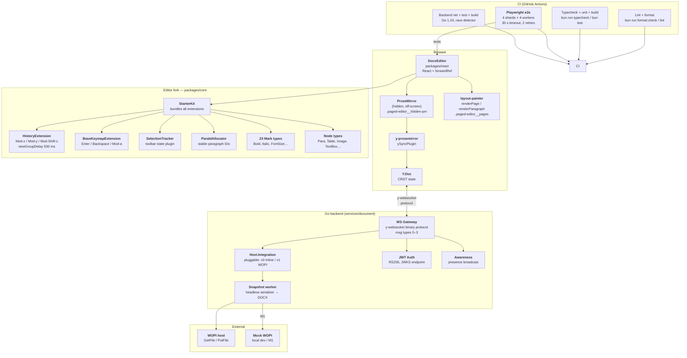

# 08 — Knowledge Graph

> A node-and-edge map of every meaningful concept in this repo —
> components, decisions, data flows, CI wiring, and release milestones.
> Updated as the project evolves; each change is traceable to the commit
> that introduced it.

---

## 1 · Component Landscape



---

## 2 · Data-Flow Walk-throughs

### 2a · Keystroke → Visible Page

```
User keydown
  → ProseMirror (hidden .ProseMirror, off-screen left:-9999px)
  → PM transaction → EditorState updated
  → PagedEditor.tsx reads new state
  → layout-painter converts to flow blocks (toFlowBlocks.ts)
  → renderPage / renderParagraph repaints visible DOM
  → selection overlay positions caret / highlights
```

### 2b · Real-time Sync

```
PM transaction (local user)
  → Y.Doc applies update
  → y-websocket sends binary update frame to Go gateway
  → gateway broadcasts to all other clients in room
  → remote clients' Y.Doc merges update (CRDT)
  → remote ProseMirror receives ySyncPlugin change
  → remote visible pages repaint
```

### 2c · Session Lifecycle (backend)

```
Client CONNECT
  ├─ validate JWT (v1+) or accept anonymous (v0)
  ├─ room exists? → join   room fresh? → seed Y.Doc from Host.Fetch (WOPI GetFile)
  └─ broadcast Awareness presence

Client UPDATE (y-websocket msg type 0/1/2)
  └─ gateway merges into in-memory Y.Doc, fans out to other clients

Last client DISCONNECT
  ├─ Snapshot worker: Y.Doc → headless DOCX serialiser
  ├─ Host.Snapshot (WOPI PutFile)
  └─ drop in-memory Y.Doc
```

### 2d · Undo / Redo

```
User presses Ctrl+Z / Cmd+Z
  → HistoryExtension keymap: Mod-z → undo()
  → prosemirror-history pops last undo group (newGroupDelay=500ms)
  → PM state reverts; visible pages repaint

User presses Ctrl+Y / Cmd+Y / Ctrl+Shift+Z
  → HistoryExtension keymap: Mod-y / Mod-Shift-z → redo()
  → prosemirror-history pops redo stack

e2e: undoShortcut() / redoShortcut() each call refocusEditor()
     before the keyboard.press to guarantee PM owns focus.
```

---

## 3 · Key Decision Nodes

| ID | Decision | Chosen | Rationale |
|----|----------|--------|-----------|
| D1 | Editor base | Fork of `eigenpal/docx-editor` (MIT) | OOXML fidelity + MIT licence + `layout-painter` for pagination |
| D2 | AGPL boundary | `@eigenpal/docx-editor-agents` removed | User directive — no AGPL code anywhere in fork |
| D3 | CRDT | Yjs + `y-prosemirror` | Documented integration path; don't propose Automerge/Loro without explicit direction |
| D4 | Backend language | Go | IO-bound workload; mature WS ecosystem; fast time-to-v0 |
| D5 | Backend state | Stateless (in-memory Y.Doc per session only) | User directive — no DB, no on-disk log |
| D6 | Persistence | WOPI host (external; integrated in M2+) | Storage-agnostic; standard protocol |
| D7 | y-websocket impl | Write our own in Go | No Node sidecar; stateless invariant; auth fits naturally; ~120-line protocol |
| D8 | First integration | Inline store (v0) then WOPI client (v1) | Decouples protocol bring-up from host-specific debugging |
| D9 | Scaling (v0) | Sticky routing on docId | Single process per room is fine until a hot room overflows; Redis pubsub deferred |
| D10 | Visual-regression baselines | Excluded from CI (testIgnore) | Darwin baselines diverge from Linux sub-pixel anti-aliasing; re-enable via one-off `--update-snapshots` job |
| D11 | typeText threshold | 100 chars (raised from 200) | Per-keystroke `keyboard.type` too slow on 2-vCPU CI for 100+ char payloads → use `insertText` |

---

## 4 · Test Infrastructure Map

```
e2e/
├── helpers/
│   ├── editor-page.ts      ← EditorPage POM (all interactions)
│   ├── assertions.ts       ← assertDocumentContains / assertParagraphAlignment…
│   ├── text-selection.ts   ← selectParagraph / clearSelection
│   └── wait-in-viewport.ts
│
├── agentic/
│   ├── scenario-runner.ts  ← ScenarioRunner.runScenario / runAll
│   └── scenario-types.ts   ← ActionType | AssertionType | DEFAULT_STEP_TIMEOUT=10s
│
├── scenarios/              ← JSON-driven scenario files
│   ├── history.json        ← undo/redo; includes 600ms waits for stable undo groups
│   ├── alignment.json
│   ├── formatting.json
│   └── … (12 files total)
│
└── tests/
    ├── scenario-driven.spec.ts  ← suite wrapper; Keyboard Shortcuts Suite → 90s timeout
    ├── performance-large-docs.spec.ts  ← keystroke latency on 312-page doc
    └── … (~50 spec files)

playwright.config.ts
  workers: 4       ← parallel within a shard
  timeout: 30_000  ← per test (suites can override with test.setTimeout)
  retries: 2       ← CI only
  shards: 4        ← matrix in CI (4 parallel jobs × 4 workers ≈ 8 min wall-clock)
```

### Known flake classes and their mitigations

| Flake class | Root cause | Mitigation (commit) |
|---|---|---|
| Toolbar focus | `role=toolbar` roving tabindex steals keystrokes | `refocusEditor()` after every toolbar click (`432b333`) |
| Dropdown scroll | `useFixedDropdown` closed on any window scroll event (capture) | Ignore events whose target is inside the dropdown (`432b333`) |
| Painter borders | `borderBottom` read from `.layout-paragraph` but painter applies it to `.layout-paragraph-border` child | Read from child overlay (`432b333`) |
| Shortcut suite timeout | 5 shortcut scenarios × ~8s each > 30s test budget | `test.setTimeout(90_000)` on suite test (`10cae5e`) |
| Redo Ctrl+Y | Focus drifts off PM after undo; Ctrl+Y lands nowhere | `refocusEditor()` at top of `undoShortcut` / `redoShortcut` (`10cae5e`) |
| Justify with large font | 109-char `typeText` via `keyboard.type` ≈ 3s on CI | Lower `insertText` threshold 200→100 (`10cae5e`) |
| Start-of-doc perf threshold | 500ms too tight; start-of-doc re-flows all 312 pages | Raise to 2000ms (`0b31f15`) |
| Multiple undos grouping | `refocusEditor` resolves < 500ms → edits collapse into one undo group | 600ms `wait` between typing steps in `history.json` (`0b31f15`) |

---

## 5 · File Ownership Map

| What you're changing | Primary file(s) |
|---|---|
| How text / paragraphs look on screen | `layout-painter/renderParagraph.ts` |
| How tables look | `layout-painter/renderTable.ts` |
| How images look | `layout-painter/renderImage.ts` |
| How pages are composed | `layout-painter/renderPage.ts` |
| Keyboard shortcuts | `prosemirror/extensions/features/BaseKeymapExtension.ts` |
| Undo / redo shortcuts | `prosemirror/extensions/core/HistoryExtension.ts` |
| Toolbar reflects selection | `prosemirror/plugins/selectionTracker.ts` |
| DOCX XML → PM doc | `prosemirror/conversion/toProseDoc.ts` |
| PM doc → DOCX XML | `prosemirror/conversion/fromProseDoc.ts` |
| DOCX paragraph parsing | `docx/paragraphParser.ts` |
| Table parsing | `docx/tableParser.ts` |
| Main toolbar | `packages/react/components/Toolbar.tsx` |
| Font size picker | `packages/react/components/FontSizePicker.tsx` |
| Alignment dropdown | `packages/react/components/AlignmentButton.tsx` |
| Editor POM (e2e) | `e2e/helpers/editor-page.ts` |
| Scenario runner | `e2e/agentic/scenario-runner.ts` |
| Scenario data | `e2e/scenarios/*.json` |
| CI pipeline | `.github/workflows/ci.yml` |
| Go gateway entrypoint | `backend/cmd/gateway/main.go` |
| WOPI integration | `backend/wopi/` |

---

## 6 · Deployment Topology

```
Distribution A — GitHub Pages (single-user demo)
  editor build → static files → doc.schnsrw.live
  No backend. No collab.

Distribution B — Docker Hub (planned, collab-on)
  ┌───────────────────────────────────┐
  │  Docker image schnsrw/casual-doc  │
  │  ┌──────────┐  ┌───────────────┐  │
  │  │  Editor  │  │  Go Gateway   │  │
  │  │  (bun)   │  │  :8080        │  │
  │  └──────────┘  └───────┬───────┘  │
  └──────────────────────── │ ─────────┘
                             │ Host.Integration
                 ┌───────────▼────────────┐
                 │  v0: inline store      │  (M1)
                 │  v1: WOPI host         │  (M2+)
                 └────────────────────────┘

Distribution C — Tauri desktop app (in progress)
  Same React+PM bundle, no network, user owns file locally.
```

---

## 7 · Release History

| Tag | Date | Description |
|---|---|---|
| `v0.0.1` | 2026-05-16 | Initial commit: document service skeleton + inlined eigenpal fork. AGPL `agent-use` purged. Bun toolchain wired. CI scaffolded. |
| `v0.0.2` | 2026-05-23 | **CI green across all 4 shards.** 169 unique test failures root-caused and fixed across 8 CI recovery commits. Key fixes: toolbar focus / roving-tabindex; shortcut suite timeout; redo-Ctrl+Y focus guard; `typeText` `insertText` threshold; performance test threshold; multiple-undo group stability. |

---

## 8 · Open Work Nodes

These are tracked items — not fixed yet.

| Node | Status | Blocking |
|---|---|---|
| Go gateway M1 (two-browser local round-trip) | Not started | Backend code not yet written |
| Bun toolchain local install | Pending (user picks method) | — |
| WOPI host target | Open question | M2 design |
| Fork GitHub org/repo | Pending | First upstream PR ready |
| Text-box rendering fidelity gap | In progress (tracked in gap matrix) | Upstream PR path |
| Visual-regression baseline regeneration | Deferred | One-off CI `--update-snapshots` job |
| Docker image publish | Planned | Go gateway M1 complete |
| Tauri app | In progress | Editor build |
